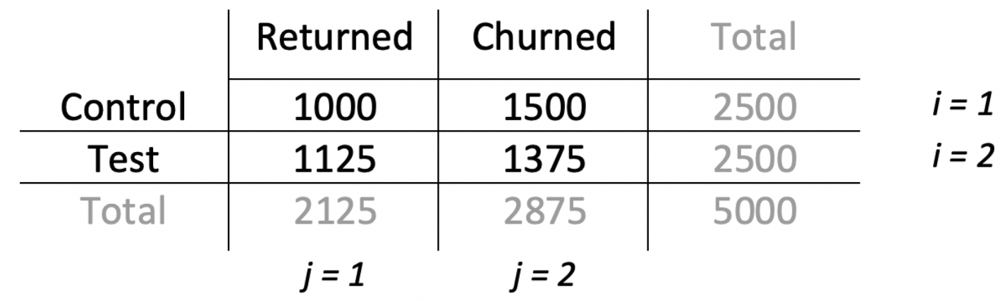
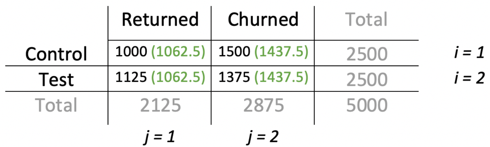
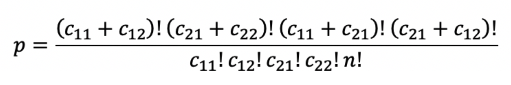
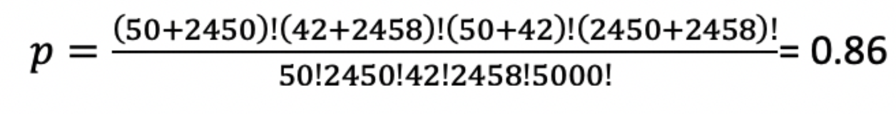

# A/B Test Example

[Source](https://medium.com/@mariap_91165)

Consider a case where we have a game and we are tring to increase retention rates by adding an additional gameplay mode. We spend time and effort to add this new mode. We find that 10% more people have churned after the first day, which is terrible. At the same time the game was reviewed by a YouTuber and highly recommended. This helped us to get 500k installs in 2 days. So, how do we make sure that the changes in retention rates are caused only within the product and don’t have anything to do with the increase in installs? This can be solved through an A/B test. 

## Experiment Design

1. **Formulate the null and alternative hypothesis**

   The $H_0$ states that the new game mode hasn’t changed anything between the control and experiment groups. 
   

   The $H_1$ states that the new feature has changed the user behavior so the metrics have either increased or decreased between the two groups.
   
2. **Plan the metrics**

   In general, the metrics fall into three categories: (1) categorical variables (binary outcomes); (2) two mutually exclusive alternatives; and (3) continous variables. 
   

   In our case, we have metrics such as retention rate, average session time, number of sessions per player, etc...Suppose we wish to test whether the new gameplay mode increases retention rate on day-1 and average session time. 
   
3. **Esimate sample size**

   Depending on the type of the metric, the method of choosing sample size varies. 
   

   
1. **Confidence interval for a proportion**
  
   This type is applicable for type (1) and type (2) of metrics. In this case we are looking for a change in proportion between groups with acceptable precision. The general formula is
   
   $$
      n = \frac{z_{1-\alpha/2}^2 \times p \times (1-p)}{\omega^2}
   $$
      where $n$ is the sample size, $Z^2_{1-\alpha/2}$ is the standard normal distribution value for half of alpha level. $\alpha$ is taken to be 5% and $\omega$ is the half of the desired confidence level. 
   
   
      Let’s say that we know the current retention rate, which is 40%. We expect the gameplay mode to increase it by at least 2%. This means that $p = 0.4$, $\omega = 0.02$ with $\alpha = 0.05$ and $Z^2_{1-\alpha/2} = 1.96$. With this we need a sample size of 2304.96 to ensure that a 2% difference in day-1 retention is statistically significant.  
   
   
   2. **Power for the test difference between two sample means**
   
   
      We use this method to estimate the total sample size when the metric is continuous. In our example we will do this for average session time. The equation to compute the sample size is: 
   $$
      n = \frac{2\times(Z_{1-\alpha/2} + Z_{1-\beta})^2}{\delta^2}
   $$
      where $\delta$ is the effect size and is given by, 
   $$
      \delta = \frac{\mu_1 - \mu_2}{\sigma_{\text{est.}}}
   $$
      where $\sigma_{\text{est.}}$ is given by, 
   $$
      \sigma_{\text{est.}} = \sqrt{\frac{\sum^n_{i=1}(x_i - \bar{x})^2}{n-1}}
   $$
      The estimated standard deviation can be calculated using historical data in the control group.
   
      In our example, we know that the average session time is 8 minutes and we expect the new feature to increase it by 1 minute. Also, from historical data we know that the estimated standard error for the average session time is 4 minutes. With this in mind, we find that $\delta$ = (8-9)/4 = -0.25 minutes and the sample required is 250. Here we took $1-\beta = 0.84$ and $\alpha = 0.05$. Hence, the numerator would be $2(1.96 + 0.84)^2$. This means that we will require 250 users in the test group to be sure that the 1-minute difference of the average session time is statisically significant. 

For the first metric we need 2304.96 users and for the second metric we need 250 users. Hence, we will consider 2305 users in each of the two groups. With this information in mind, we are ready to execute the test. 

## Evaluating the Results

Suppose we ran the A/B test with 2500 users in each of the two groups and found the following: 

* Average session length increased from 8 to 9 minutes
* Day-1 retention increased from 40% to 45%
* Conversion rate lowered from 2% to 1.7%

### Parametric Tests

Let’s see if the change we see in the average session length, which incraased by 1 minute is significant or not. Because the average session length can be assumed to be normally distributed, we make use of parametric test here to check whether the difference is significant. We use the t-test for this.

 

We have the two means from the control and experiment groups: $\bar{x_1} = 8$ and $\bar{x_2} = 9$. The standard deviation of the two groups are: $\sigma_1 = 0.5$ and $\sigma_2 = 0.6$. The number of users in both groups $n_1 = n_2 = 2500$. Knowing this we have: 
$$
t = \frac{(\bar{x_1} - \bar{x_2}) - (\mu_1 - \mu_2)}{s_p\sqrt{1/n_1 + 1/n_2}}
$$
 where $\mu_1$ and $\mu_2$ are the population means for each of the two groups. They are generally unknown. $s_p$, the sample group variance is given by,
$$
s_p = \frac{(n_1 - 1)s_1^2 + (n_2 - 1)s_2^2}{n_1 + n_2 -2}
$$
where $s_1$ and $s_2$ are the standard errors of each of the two groups. 

To reject the null hypothesis, we set $\mu_1 - \mu_2 = 0$. Plugging in the values we find $s_p = 0.55$ and $t \approx 22726$. To reject the null hypothesis at $p = 0.05$, the $t_{critical} = 1.96$. As our t value is much larger than this value, we can safely reject the null hypothesis and state that **the difference in the average session time is statisically significant**.   

### Non-parametric Tests

We use the non-parametric tests for the other results because the data are discrete and we cannot assume the distribution to be normally distributed.

#### $\Chi^2$-test

 

We would like to know if the 5% increase in the retention rate is significant or not. Suppose our data from the retention between the two groups looks like this: 




To check the difference between the two groups, we will use the chi-square test.  For chi-square we need the observed values and expected values. 

* Observed values are the numbers we get from the experiment
* Expected values are the values we would get if the null hypothesis is correct, i.e. there is no difference between control and test groups

To calculate the expected values from the data we use the following formula: 
$$
E_{ij} = \frac{\text{ith row total} \times \text{jth column total}}{\text{total}}
$$
Using this information we get the expected values (marked in green) in the table below: 



Now, we calculate the chi-square statistic. This is given by, 
$$
\Chi^2 = \sum^R_{i=1}\sum^C_{j=1} \frac{(O_{ij} - E_{ij})^2}{E_{ij}}
$$
where $O_{ij}$ is the observed values and $E_{ij}$ is the expected values and $R$ and $C$ are rows and columns. Plugging these numbers in, we get $\Chi^2 = 12.79$.


Next we compute the chi-square critical value. For this we need to know the degrees of freedom. This is given by, 
$$
\text{degrees of freedom} = (R-1)(C-1)
$$
In our case R = 2 and C = 2, so the degrees of freedom are 1. Using $\alpha = 0.05$ and 1 degree of freedom, we find that the critical value is 3.841. As our chi-square value is larger than this value, we can reject the null hypothesis. 

#### Fisher's Exact Test

The data for conversion rate dropped from 2% to 1.7% is given by the table below: 


Fisher’s exact test is a non-parametric test that is often used as a substitute for chi-square when the data set is small or the categories are imbalanced. In our case, the table shows quite a large imbalance between payers and non-payers. In other words converting non-payers to payers.

In this case the null hypothesis states that the number of payers among players in the test group is the same as in the control group while the alternative hypothesis states that there are fewer payers in the test group. 

Fisher’s test calculates the probability of results being at least as extreme as in the data or more extreme. This is given by, 



Plugging in the values we find, 



We can do this in Python as follows: 

```python
from scipy.stats import fisher_exact
oddsratio, pvalue = fisher_exact([[50, 2450], [42, 2458]])
```

The p-value is 0.86 which is higher than 0.05. This means that we cannot reject the null hypothesis. In other words, **the drop in conversion from 2% to 1.7% is not significant**. 

