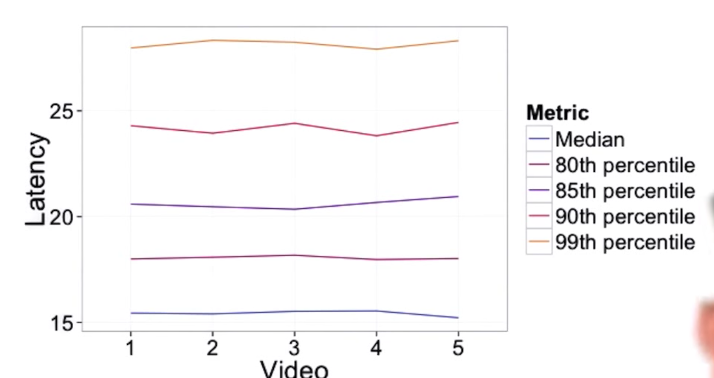
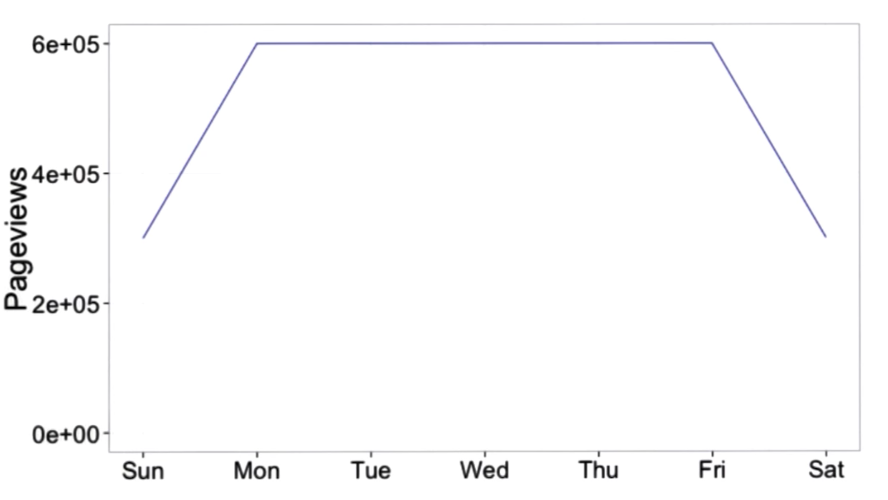

[TOC]

# A/B Testing 

These are my notes from the Udacity Course on A/B Testing 

## Lesson 1: Overview of A/B Testing 

In this first lesson we learn about what A/B Testing is and what it can be used for. 

### Introduction

A/B testing is a general methodology used to optimize a website or mobile app by testing which version of a website or an app works best. The process starts by designing an experiment which has two or more versions of what needs to be tested (e.g. a website), a metric to identify and quantify the difference between the versions, and draw conclusions from the experiment. The three steps in A/B test are the following: 

* Design an experiment
* Choose metrics 
* Draw conclusions

The A and B in A/B testing correspond to the **control group** and the **experiment group**. For example a control group could be a current version of the website while the experiment group could be a different version of the website that we hypothesize will allow us to achieve our business goals. 

> A/B testing works when the changes are incremental rather than those that are fundamentally different. 

It is easier to do an A/B test when the changes in the design of the website are incremental rather than totally different. This makes sense as the metric used to identify which version is better needs to have considerable overlap. 

Various things can be tested using A/B testing. These include: 

*  Features in websites or apps. 
* Ranking changes that are more in the background 
* Changes in the load time of a page

A/B testing does not work on: 

* **New user experience** as there is no objectivity, which happens due to change aversion or novelty effect. 
* **Time** can be a challenge because if a user visits a website once or twice a year, the time range is too long to do an experiment and see a difference. 
* A/B testing cannot tell you if you are **missing** something. There is no feedback mechanism that allows A/B testing to inform you what the users are missing on your site. 

In cases where A/B testing cannot be used, we can still collect the data on the users to see what they clicked on and what they did not. This allows the company to enhance the goals even though they did not make use of A/B testing. 

The A/B testing is marketing term used for hypothesis testing. Just like clinical trials are performed to see which drug works best for an ailment. Similarly an A/B test tests which version of a website works better for the users. In A/B test we should ensure that we get consistent results from the control group and the experiment group. 

The difference between the data in A/B tests and in clinical trials is that A/B tests can have a large amount of data but the resolution of the data is low. On the other hand in clinical trials, the data are much smaller but the resolution is very good. Here resolution means the richness of the data as opposed to its quantity. In clinical trials, we know a whole lot about the patients which is something we don’t in online users. 

### A Business Example

Let’s consider an example to apply A/B testing. We have a landing page for our educational website such as Udacity. We want to create two versions of a `Start Now` button on the website that allows users to explore the educational website’s courses. 

The steps followed at the website are the following: 

1. Landing page or Homepage
2. Click on the Start Now button and explore the site
3. Create an account
4. Complete a course

These four steps can be seen as a funnel in terms of the numbers of users who go from steps 1 through 4.  It is a funnel because we expect the number of users to decrease as they go down the funnel. 


The hypothesis of the experiment would be: **changing the “Start Now” button from orange to pink will increase how many students explore the udacity courses**.

### Choosing a Metric

For the example, we can think of the following metrics: 

1. Total number of courses completed. However, this would take too long and therefore may not be practical.
2. Number of clicks. This sounds promising as a higher number clicks on the Start Now will take more users down the funnel. However, the clicks don’t always tell the whole story. For example, we can have more clicks but less conversion or less clicks and more conversion. Here conversion corresponds to the number of users who visit and then go on to creating an account. So, just the number of clicks may not work the best. 
3. Ratio of the number of clicks and page views.  This is known as the **click-through-rate** or **CTR**. However, the weakness in this is that the number of clicks on the page does not tell us whether the user went down the tunnel. For example, a visitor could have clicked twice or five times on the Start Now button because the page was slow to load but only explored the website and did not create an account. We would then erroneously count the total clicks by that user. 
4. The ratio of the unique visitors who click and unique visitors to page. This is known as **click through probability**. This corresponds to the unique visitors who clicked at least once over the number of unique visitors who visited the page. This takes care of the problem in 3. So, even if the user clicked 5 times, only one click will be registered for the page view. 

To give an example for 3 and 4, consider the case where two people visit the site. One does not click while the second one clicks 5 times. The CTR would be: 5/2 = 2.5, while the CTP would be 1/2 = 0.5. 

We will use CTP as our metric. So, our updated hypothesis would be: **Changing the “Start Now” button from orange to pink will increase the click through probability of the button**. 

> Generally speaking, use the **rate** when measuring the **usability** of the site and use the **probability** to measure the total **impact** of the site. 

For example, if you want to measure how useful the button is on the site, you would use CTR. However, if you want to measure who many people used the button to move on to the next page, use probability. 

### Which Statistical Distribution to Use? 

Various probability distributions can be used in A/B testing. For our current business case, we will consider binomial distribution because our data are not continuous but discrete. This is also because there are exactly two outcomes: click or no click. We can call a click a success and no click a failure.  

In the case of binomial distribution, we have the following properties: 

* Probability of success is, $p$, while the probability of failure if $1-p$. 
* The mean of the binomial distribution is $p$
* The standard deviation of the binomial distribution is, $\sqrt{p(1-p)/N}$, where $N$ is the total number of trials. 
* The confidence interval that we will take for this is the typical 95%. Using this we will create the confidence interval for our experiment. 

In our experiment, suppose we have $x$, the total number of people who clicked and $N$, the total number of users. Then the probability would simply be: 
$$
p = \frac{x}{N}
$$
The width of the confidence interval, the margin of error, can also be computed. Rather than considering the binomial probability distribution, we consider the normal distribution. **This is because if $N \times p > 5$, we can safely substitute the binomial distribution with a normal distribution.** 

In the case of the normal distribution, the margin of error is $z \times SE$. So, this is given by, 
$$
m = z \times \sqrt{\frac{p(1-p)}{N}}
$$
Note that the margin of error depends on the successes, $p$ and the size of the sample $N$. So, we need to know how many samples to collect when we consider the probability of success. We will talk about this later. 

> For the z-distribution, the value of z-critical at 95% confidence is $\pm1.96$.

For our case, were we have $N = 1000$ and $p = 0.1$, the margin of error comes out to be, $m = 0.019$. The confidence interval would then be: $0.081 - 0.119$, with a center at $0.1$. 

------

**Example:** 

Suppose $N = 2000$ and $x = 300$, find the 99% confidence interval: 

$p = \frac{300}{2000} = 0.15$; $m = 2.58 \times \sqrt{(0.15)(0.85)/2000} = 0.021$. So, the confidence interval is: 

$m = 0.129 - 0.171$.  

------

### Hypothesis Testing

Once, we have this we need to set up hypothesis testing. In the case of hypothesis testing, there are two hypothesis: 

* **Null hypothesis:** which states that there is no difference between the two groups that you compare. In other words, there is no difference between the hypothesized distribution and the true distribution. 
* **Alternative hypothesis:** which states that there is a difference between the two groups we compare, that the hypothesized distribution is different from the true distribution. 

There are few nuances to be considered: 

* If the null hypothesis states that there is no difference between group A and group B, the alternative hypothesis would then be, there is a difference and it is not equal to zero. The difference could be positive or negative. In this case we have a **two-tailed test**
* If the null hypothesis states that the difference between group A and B is greater or equal to zero, the alternative hypothesis would state that the difference between the two groups is negative. In this case, we have a **lower-tail test**
* If the null hypothesis states that the difference between group A and B is smaller or equal to zero, the alternative hypothesis would then state that the difference between the two groups is positive. In this case, we have a **upper-tail test** 

### Comparing Two Samples

In our experiment there are two distributions, the distribution of control group and the distribution of experiment group. When we compare the two groups, we need to look at the proportions of the two groups and see if their difference is significant or not. 

In our example, we have the following: 

$x_{cont}, x_{exp}$ and $N_{cont}, N_{exp}$

We then compute the **pooled probability**. This is the probability of the clicks across groups. This is given by, 
$$
p_{pool} = \frac{x_{cont} + x_{exp}}{N_{cont} + N_{exp}}
$$
The pooled standard error is given by, 
$$
SE_{pool} = \sqrt{p_{pool} * (1 - p_{pool}) * (1/N_{cont} + 1/N_{exp})}
$$
The difference between the two probabilities is then given by, 

$d = p_{exp} - p_{cont}$ 

Finally, we state our hypothesis. 

$H_0: d = 0$. 

Here we assume that the distribution of the difference is a normal distribution with mean of zero and standard error equal to the pool standard error. Finally, we use the 95% confidence interval. 

If $d > 1.96 \times SE_{pool}$ or $d < -1.96 \times SE_{pool}$, we say that the difference is significant and we can reject the null hypothesis. We say that the difference between the two groups is significant. If not, we are unable to reject the null hypothesis. 

> There is a difference in terms what is deemed to be statistically significant and what is **practically** or **substantively** significant. Generally, practically significant is larger than statistically significant. 

For example, you can have 0.8% significance but considering the engineering solutions and what makes more sense from the business perspective, we may want the difference to be 2% or larger. This would then be practically significant. 

In other words, from the business perspective we need to ask ourselves whether 0.8% be significant enough when this may require large investment?

### Size and Statistical Power

Before we run the experiment, we need to know how many page views or clicks we need to be *statistically significant*. This is called **statistical power**. This is because when we see something is statistically significant, we would like to know that this is indeed true with high probability. 

> Power and size and inversely proportional. To see a smaller change that is statistically significant, we need to have a larger size. 

The idea of size and power comes from the Type I and Type II error. 

* **Type I** error is the error you make when you reject the null hypothesis even when it is right or true. This is known as **$\alpha$.** 
* **Type II** error is the error you make when you fail to reject the null hypothesis even when it is wrong or false. This is known as $\beta$. 

**Statistical power** is defined as $1 - \beta$. This is also know as **sensitivity**. Generally this is chosen to be 80%. In other words, $\beta = 0.2$.  

* When we use a small sample, $\alpha$ is low but $\beta$ is high which means the power is low. 
* When we use a large sample, $\alpha$ remains low and so does $\beta$ which means the power is high.

------

**Example**

Let’s compute the number of page views we need in each group to see a significant difference between the two groups. We are given: 

N = 1000, x = 100, d = 2%, $\alpha$ = 5% and $\beta$ = 20%. 

where N is the total number of unique page views we collected, of these x = 100 resulted in the conversion. The detectable threshold is set to 2%, while the level of significance and power are set to 5% and 20%, respectively. 

Using the following [online calculator](http://www.evanmiller.org/ab-testing/sample-size.html), we compute the number of page views we need: 

Our baseline conversion rate is 10% (100/1000) while the minimum detectable effect is 2%. Using this, we compute our sample size to be 3,623 page views per group. 

------

 Here’s an example of how the number of page views varies: 

| Change                                    | Increase Page Views | Decrease Page Views |
| ----------------------------------------- | ------------------- | ------------------- |
| Higher CTP in control (but still < 0.5)   | True                |                     |
| Increase practical Sig. level (d$_{min}$) |                     | True                |
| Increase conf. level (1-$\alpha$)         | True                |                     |
| Higher Sensitivity (1 - $\beta$)          | True                |                     |

* We see that higher CTP will require higher increase in page views because as the probability gets closer to 0.5 (x/N), the value in the numerator of SE will increase. So, to keep the SE the same, we will have to increase N. 
* Larger changes ($d_{min}$) are easier to detect so you don’t need a large size.
* The higher confidence level means that you want to be more certain that the change is significant. In which case, we want higher sample size. 
* Higher sensitivity of the experiment means that we need larger sample. 

### Calculating Results

Suppose we ran the experiement and we get the results. We use this information to compute the practical significance and margin of error. 

------

**Example**

$N_{cont} = 10,072$								$N_{exp} = 9,886$

$X_{cont} = 974$										$X_{exp} = 1,242$

We use $\alpha = 95\%$ and $d_{min} =  2\%$. 

We have, 

$p = (974 + 242) / (10072 + 9886) = 0.111$. 

$SE = \sqrt{(0.111 (1 - 0.111)(1/10072 + 1/9886))} = 0.00445$.  

$d_{min} = (1242/9886 - 974/10072) = 0.0289$

$m = 1.96 \times 0.0445 = 0.0087$

So, the confidence interval would then be: 

$d_{min}\pm m = 0.0289^{0.0376}_{0.0202}$ 

------

We conclude that the difference is more than our practical siginficance of 2% at the lower bound indicating that the difference is indeed significant and we can reject the null hypothesis at the 95% level. So, we can launch the new level. 

 

## Lesson 2: Policy and Ethics for Experiments

In this lesso we will look at the policy and ethics of the experiment. This is regards to the fact that when experiments are performed, we should ensure that the people are not harmed or scared for life! The principles to follow when carrying out experiments are the following: 

* Risk: What is the risk the participant is exposed to? 
* Benefits: What benefits might be the outcome of the study? 
* Alternatives: What other choices to partcipants have? 
* Data Sensitivity: What degree of privacy and confidentiality to participants have? 

We will go through each one of them in greater detail. However, please note that this lesson is simply an overview of the policy and ethics that need to be followed in experiments. 

### First Principle: Risk

The first principle is that of risk. It is important to know the degree of risk the participant will face beyond a minimum threshold. The minimum threshold is set to be that of the risk the participant faces in their daily lives. The risk can be psychological, physical, emotional, social or economical. If the risk is higher than the minimum risk, an informed consent from the participant is required. 

------

**Example** Is the risk greater than minimal risk? In each of the following tell us whether the risk is minimal or greater than the minimal risk. 

1. Search engine tests change adding price information to results page
2. Health app lets users know possible consequences of their diets
3. Online encyclopedia tests changing the location of the search bar

The risks are minimal is all of the cases except case 2. This is because without information about the participants well-being, advising the participants on consequences of their diets can have adverse effect on their physical health. 

------

### Second Principle: Benefits

We need to answer the question in terms of the benefits that the participants will have from the study. In most A/B testing, the benefits are around improving the product or a website. However, in other cases there could be more impact to their lives such as educational development. Therefore, it is important to state the benefits the study will have to the participants. 

### Third Principle: Alternatives

In order to have a non-bias experiment, the participants must be given alternatives that do not coerce the participants to choose what the experimenter wants. This allows to really see whether the difference between the control and the experiment is truly signficant or not. 

For example, when trying out a feature in the search engine, the participants must have access to other search engines that exist. 

### Fourth Principle: Data Sensitivity

The participants should know what data is being collected about them and how it would be used. Furthermore, they should also be aware whether the data will be made public or kept private or confidential. 

If the participants are observed in a public setting, the question of confidentiality does not arise. The same goes with public data used for the experiment. However, if the setting is private, such as interviews behind closed doors and the data are not public, care must be taken to maintain privacy. 

The data can be either anonymized or psuedonymized. An **anonymous** data means that data is stored and collected without any personally identifiable information while **pseudonymous** data is stored with randomly generated ID. Use HIPAA guidelines when it comes to anonymizing data. 

------

**Example** Consider the following and check which data is sensitive: 

1. Existing census data with rage, age, and gender by zipcode
2. Number of users visiting specific sites each day
3. User-entered glucose levels with timestamp and anonymous ID
4. Achievement kills and level advances in an online game by anonymous ID
5. Number of purchases and total money spent by zipcode
6. Credit card information

The ones that are sensitive are 3 and 6 and timestamps are considered sensitive by HIPAA. 

In summary, when looking at policy and ethics, you need to answer the folllowing questions, 

1. Are users being informed? 
2. What user identifiers are tied to the data? 
3. What type of data is being collected? 
4. What is the level of the confidentiality and security? 

## Lesson 3: Choosing and Characterizing Metrics

In this lesson we will deep dive into the metrics for experiments. We will begin with a way to define a metric, then build an intuition on what a metric is and finally end the lesson with characterizing a metric. 

### Metric Definition

The main idea behind A/B testing is to measure whether the experiment group is better than the control group or not. To gauge this, we create various types of metrics. Before you define a metric, it is important to know how you are going to use it. 

The **first metric** that is often created is for sanity checks. We want to ensure that during our experiment, the underlying experiment does not change. Such metrics are called **invariant metrics**. They provide us with a sanity check. For example, a metric could check the number of participants between groups or the distribution of the population. 

The **second metric** is the **evaluation metric**. There are various types of evaluation metric: business metrics and the user-experience metric are two such examples.  

* The **business metrics** could be high-level that looks at the total revenue that is made, how the experiment adds value to business and so on. 
* The  **User-Experience Metric**, is more deep in terms of how the user interacts with a site or an app. For example, we want to know why the users do not complete lessons on the site. This could be because of latency of the page loads, the quizzes are hard, and so forth. 

How do we come up with a metric? The steps to create a metric are as follows: 

1. **Come up with a high-level concept of a metric.** This is a one-sentence summary that everybody is going to understand. For example, “active users” or click-through-rate probability. 
2. **Find all the nitty gritty details about the metric.** For example, if you decide on “active users”, dig deeper to understand what do you mean by “active”. Is activity defined as 7 days or 28 days? Which events count towards activity? 
3. **Take all the details from step 2 and summarize them into a single metric.** This could be an average of all small metrics, or an average, etc...

For sanity checks, we have multiple metrics. So, should we have mulitple metrics for the evaluation as well? 

There could be a single metric or multiple metrics. This depends on what is expected at a company. Some companies have a single metric while other make use of multiple metrics. But for PR purposes or external reporting, you may want to settle on a single metric. 

The other thing to do is to create a **composite metric**. Such a composite metric could be an objective function or the **Overall Evaluation Criterion (OEC)** that is used by Microsoft. However, defining OEC can be (1) hard; (2)  there is a fear of over optimizing one thing and not look at other things in reference to the one in consideration; and (3) when the metric begins to move, the people may want to have a single metric and then you go into looking at each of the single metric. 

> It is important to define a metric that can be used across a suite of experiments rather than for a specific test

### Our Business Example

Let’s consider our business example of a Udacity educational website. The business objective for such a site would be: 

* Helping students get jobs
* Financial Sustainability

Given our funnel from lesson 1, we would like to add more steps in the funnel to address our business objective. Such steps would be: 

* **No. of homepage Visits**
* **No. of users exploring the site**
* **No. of users who view course list**
  * No of users who go on to view course details
* **No. of users created an account**
* **No. of users who enroll in a course**
* No. of users who finish lesson 1, lesson 2, etc...
* No. of users who sign up for coaching at various levels
* **No. of users complete the course**
* No. of users who enroll in a second class
* **No. of users who enroll in coaching**
* **No. of users who get jobs**

With this in mind, our primary funnel will look something like this: 


The funnel illustrates the number of users that go through the funnel. In other words as we go down, the number of users decrease. Note that the direction is not always linear. Often we have swirls between stages or back and forth. There are various metrics that you can use to consider this back-and-forth process: 

* **Count:** The count is simply used to count the number of users who reach each stage in the funnel. You can decide to keep count between key stages. For example, the count of people who visit the homepage and the count of people who enroll. 
* **Rates:** Between consecutive levels, you want to use the rate to measure the percentage of the people from the previous stage who moved to the next stage. Rates are generally used to determine the usefulness of a feature. 
* **Probability:** Rather than using rate for each consecutive level, you can measure the probability of each unique user who goes down the tunnel. In other words, the probability of progressing from a course list to course page or probability of progressing from course page to enrolling. 

The business model will dictate what is used. 

------

**Example**

We are given three tasks that we would like to perform. We are also given the five metrics that can be used. For each of the tasks, list which of the metrics would work the best. 

* Update a description on the course list page
* Increase size of “Start Now” button
* Explain benefits of paid service

The metrics are: 

1. CTR on ’Start Now’ button
2. CTP on “Start Now” button
3. Probability of progressing from course list to course page
4. Probability of progressing from course page to enrolling
5. Probability that enrolled student pays for coaching

Here’s what I think: 

* Update a description on the course list page: 3, 4
* Increase size of “Start Now” button: 1, 2
* Explain benefits of paid service: 4, 5

------

Sometimes it can be hard to measure a metric because (1) we don’t have access to the data and (2) it takes too long. Let’s look at an example. 

------

**Example**

Which metric would be hard to measure? 

1. Rate of returning for second course: No. of user who start second / No. of users who complete first? 
2. Average hapiness of shoppers
3. Probability of finding information via search

For the first case, it will take too long. What if the user returns after 6 months or a year. The average happiness of shoppers could be measured using the reviews left by the shoppers. So this is doable but hard. The third is hard because we don’t have enough data. 

------

### Using Proxy Metrics

When the metrics are difficult to measure directly, we can use additional techniques. There are a lot of [such techniques](https://s3-us-west-2.amazonaws.com/gae-supplemental-media/additional-techniquespdf/additional_techniques.pdf). In brief, the additional techniques are **surveys, external data, retrospective analysis, focus groups** to name a few. These techniques can be used to brainstorm new ideas or evaluate existing ones or validate them. 

The two main methods that are often used to address the challenge in metrics is to use **external data** or **your own existing data**. Let’s look at each in more detail.

#### Use External Data

If you decide to use external data that will help you to create metrics or validate the ones you have, there are three sources that exist 

1. **Companies that collect granular data:** These are collected by companies such as Comscore and Nielsen. They collect data on the CTRs on websites to television views.
2. **Companies that run surveys:** These companies run surveys and collect data on various types of users and on very broad topics such as the number of devices they have, the time they spend on devices, what search engine they use, etc.... These companies are Pew or Forrester. 
3. **Academic Research:** These collect data, create metrics, run correlation studies etc...on various broad topics. Often there data is public and free of charge.

All of these sources are good for brainstorming, to evaluate your own aggregate metrics, and to develop new validation techniques. 

#### Use Own Data

When it comes to using our own data, it means that we will use the data that we have gathered to create metrics that will allow us to answer the questions we have. 

In this category there are two classes of methods that are used. The two classes are the following: 

* One class uses all of our existing data. The methods that are used are called **retrospective analysis** and **running the experiment**. 
* Collects new data as the existing data cannot explain what you are trying to achieve. Techniques used here are **User-Experience Research (UER), surveys,** and **focus groups**. 

Let’s look in more detail as to what you can do with your own data. 

* **Retrospective or Observational Analysis**: Here you look at how your metrics changed over time, how they reacted to the experiments that you performed. This allows you to create a baseline for your metrics and new theories. Surveys and output from focus-groups can also be used here. For example, through focus-groups you found that every student got stuck on a specific quiz. This then allows you to dig deeper into it and modify as per your needs. These studies show you correlation and not necessarily causation. 

  The retrospective analysis can also be run to validate the metric. This is because we want to ensure that the metric moves as there are changes in the data. 

In summary, there are three ways of gathering additional data which in turn allow you to work on metrics that are difficult to create. 

* **User experience Research (UER)**: is the process of discovering the behaviors, motivations, and needs of your customers through observation, task analysis, and other types of user feedback. Here are some techniques and benefits of using UER. 
  
  * Good for brainstorming
  * Finding problems in your user-experience
  * Create new metrics
  * Use special equipment (use eye-movement camera)
  
  Always make sure to validate the results of UER before using it
  
* **Focus Groups**: are a form of qualitative research that involves bringing a group of individuals (6-12 people) together in a room and engage in a guided discussion on a topic.  Here are some techniques and benefits of using Focus Groups: 
  
  * Allow to bring more users but cannot go as deep as UER
  * Get feedback on hypotheticals
  
  In Focus Groups, you run the risk of group thinking so be cautious. 
  
* **Surveys**
  
  * Cheap to run
  * Get a lot of data
  * Not deep as UER or focus groups
  * Useful for metrics you cannot directly measure
  
  Authenticity of the data could be questioned so it is harder to trust.

> Above techniques show correlation but not causation

In terms of depth and the number of participants, the above techniques perform in the following way: 


In our example of Udacity website, we can compare our homepage visits with external data from other educational sites. We can also use UER to investigate low completion of the courses with external data. The UER can also be used to validate our metric’s performance over time. 

We can also use surveys to see which of the students who completed the courses got jobs. Unfortunately, the external data in this case may not help because the population of the external data who got jobs after completing the course work may not match the population that you have. Nonetheless, these examples illustrates how we can use external sources to create metrics. 

Let’s revisit the metrics that we went over before in our example but found it tricky to use. We can see what additional techniques we could use to solve this: 

* Rate of returning for 2nd course
  * Survey what causes users to return
  * Learn from the survey and create a metric
* Average happiness of shoppers
  * Survey
  * Run a small UER
* Probability of finding information via search
  * Length of time spent on a web search
  * Clicks on results
  * Follow-up queries
  * All the above can be done using external data, UER, and human evaluation

------

**Example**

Let’s see an example to choose which of the additional techniques could be used to generate metrics:

1. Measure User Engagement

2. Decide whether to extend inventory
3. Which ads get most views

Here’s what the answer is: 

1. Focus Group, Retrospective Analysis
2. External Data, Survey
3. UER, Experiments

------

### Metric Definition and Data Capture

There is a big difference between the theoretically defining the metric and implementing it. There are generally two steps that are followed to implement a metric that we have thought of: 

1. **What data are we going to look at to compute the metric?** This could be, the type of clicks to capture, either to filter the data or not, etc...
2. **Given the events, how to summarize the metric?** This could be as simple as deciding whether to compute a mean, a median or any other summary statistics. 

The reason for following the above steps is to build an intuition. A good analyst would be the person who can understand what changes in your data and in your metrics,  your system can and can’t produce. This allows us to decide whether what the metric is telling us is realistic or not. This also helps us get the intuition about whether the change we see in our metric is real or if there is a bug in our experiment. 

Let’s look at an example. We wish to compute CTP. How do we go about doing that?  We can do this in the following ways: 

1. Simply divide the total number of clicks we are interested in by the total number of clicks. 
2. We can use a cookie to estimate whether the user visited the site and clicked on the link or not. 
3. We also need to decide the time spent between events. If the page loads and there is no click for 15 min. do we count this click? In the same way, how do you divide the data you have collected? 

------

**Example**

Let’s look at a way to define a metric. Let’s say we want to define a CTP as our metric. This is a high level metric and defined simply as the number of users who click over the total number of users who visited the site. However, we can look at some of the nuances: 

1. For each time interval, we could count the number of cookies that registerted a click over the total number of cookies that interacted with the page. We note that changing the time interval will change the metric we define. For example, a site only has one user. She loads the page and clicks. Then 5 minutes later, she reloads the page but does not click. Thirty seconds after that, they reload and click. And finally, they reload the page and do not click after 12 hours. This would look something like this: 

   
   Assuming the cookie remains the same. Since two groups resulted in a click but the third did not, the per minute CTP would then be, 2/3. But if you grouped by the hour, there are two groups, so the per hour CTP would be 1/2. Finally, per day CTP would be 1. 

   We see that there are three groups. 

2. Rather than considering unique ID for a user, we can create a unique ID for each page view. When the user clicks, record the ID of the parent page view. The CTP would then be defined as, 
   $$
   CTP = \frac{\text{page views with click within time interval}}{\text{total page views}}
   $$
   This definition also requires a time interval. In other words, how long should we wait until a page view results in a click? 

3. A simpler definition would be to could the total number of clicks and divide by the number of page views. This would be CTR rather than CTP. 

Which metric remain unchanged when the following problems occur: 

| Problem                 | Def 1 | Def 2 | Def 3 |
| ----------------------- | ----- | ----- | ----- |
| Double Click            | X     | X     |       |
| Back Button Caches Page | X     |       |       |
| Click-tracking bug      |       |       |       |

------

### Filtering & Segmentating

There are cases when you want to filter your data. This could be because some entity could be trying to mess up your data or certain events are simply outliers and need to be removed. 

Sometimes, events such as blog coverage, or something about your website being mentioned on TV, can skew the number of visits on your site. Such events should at least be flagged. 

The above are examples of external influencing your experiment. But there are also internal influences. For example, the experiment you run only affects the mobile platform and not the desktop platform. Therefore, we get a complete picture when data from all other platforms are filtered out. This is because you do not want to dilute your experiment. 

However, filtering can cause bias in the data. You want to ensure that biasing does not occur. Even when filtering outliers, make sure there is a good reason to do so. 

So, how do we decide whether to use a filter or not? To check whether the filtering is causing an effect on your metric is to slice the data by country, time or any other interval and seeing whether the change we see in the metric is due to filtering or not. Week over week or day over day of traffic pattern can help weed out spam as grouping this would smooth out most variations and will result the anomaly showing up. 

At the end, through your intuition you will find out whether the data you get is correct or suspicious. 

### Summary Metrics

So far we have seen individual scores such as CTR, load time, page views etc... per event. The idea is then to create a summary metric to capture these individual values.

There are four metrics that are used to summarize the experiment: 

* Sums and counts
  * no. of users who visited the page
* Descriptive statistics such as mean, median, quartiles, etc...
  * The mean age of users who completed a course
  * Median latency of page load
* Probabilities and Rates
  * Probability in terms of outcome between 0 and 1
  * Rate has 0 or more. 
* Ratios
  * revenue generating click / any click on the page

When choosing summary metrics, you want to choose such that the metric is sensitive to the changes you are interested and robust to changes that you don’t want to measure. 

The other way to choose a summary metric is to look at the distribution of the metric you have at hand. The distribution of the metric can be plotted during retrospective analysis. Based on the distribution you can decide which metric to use. For example, if your metric has a distribution of a normal distribution, then it makes sense to use mean and standard deviation as summary metric for that metric. 

The most common distributions that are used for online data are the following: 

* Poisson distribution: When the measure requires a time period or space, Poisson distribution is ideal to be used. 
* Zipfian or Pareto distribution: This is known as the power-law distribution. These are used for rare events such as the frequency of words in a text. 
* Composite distribution: This comes up when your distribution can be fit using a composite distribution rather than a single one. 

#### Sensitivity & Robustness of a Metric

The sensitivity and robustness of a metric is similar to the sensitivity and robustness of a test we saw in Chapter 1. We want to have a metric that is sensitive to changes we care about but robust against changes that we don’t care about. 

There are various ways to test if the metric that we have at hand is sensitive and robust. Here are some possibilities: 

1. **Create an experiment** to test the metric
2. **Do a A vs A test** to see the sensitivity of the metric. In such an experiment, you want to see if the metric is sensitive to noise. Ideally, you should expect the metric no change. 
3. **Use historical experiment data/information** to see if the metric changed over time or whether it changes when applied on historical data. 
4. **Do retrospective analysis** on the data that have gathered earlier. 
5. If you don’t have previous data, look at the changes you made to the site and see if the metric changed or moved in conjunction to the changes to the site. Or simply look at the history of the metric and see if you can find a cause that changed the metric

------

 **Example**

We would like to choose a summary metric for latency of a video. There are two ways to look at this: using retrospective analysis or doing an actual experiment. Let’s look at the retrospective analysis first. 

Suppose we look at the latency of five different videos across 100 users. We can view this information using a histogram but. density curve is easier to view and compare. Suppose we do this across 5 different videos and find that the latency is fairly comparable. 

Now, we look at some of the summary metrics. 



These are the mean, the median, the 90th and 99th percentile. We can plot these together on the same plot to see how to change across these comparable videos. We find that the mean and the median don’t change much but the 90th and the 99th percentile very quite a lot. Therefore, we conclude that these two metrics and not robust enough. However, these metrics could be robust but could be influenced by the video quality. So, before we compare and make conclusions, we need to be sure that other factors are not influencing these metrics. Here the care was taken to exclude all external factors. 

Let’s look at the experiement example. 


We have the same number of users as above but this time we change the resolution of the videos that the users view. We then measure the latency of the videos. We expect the latency to decrease for lower resolution. Again computing the summary statistics, we find that the median and the 80th percentile remain flat but the 90th and 99th percentile decrease as expected. Therefore, we conclude that the median and the 80th percentile are not sensitive enough. 

------

#### Absolute versus Relative Difference

When you have the control group and the experiement group, as we had in Chapter 1, we made use of the absolute difference between the two groups. This works good as a starting point, that is when we are evaluating the metric or getting an intuition about the metric or when we do just one experiment. However, if you are doing mulitple experiements, you need to make use of the relative change. The **advantage of relative change** is that you only have to choose one significant boundary to get stability over time. The relative change works best when the data is affected by seasonality or number of experiements. The **disadvantage of relative change** is that the ratios are not always well behaved as oppose to absolute differences. So, if you are just starting out, use absolute differences. 

> The **absolute difference** is the result of subtracting one from the other. 
>
> The **relative difference** is the absolute difference divided by the control metric. 

If you run an experiment and measure 5000 visits in the control and 7000 visits in the experiment, the absolute difference is 2000 and the relative difference is 2000 /5000, which is 40%. 

In the case of relative differences in probabilities, 

> **percentage points** refer to **abolute differences**
>
> **percentages** refer to **relative differences**. 

### Variability

Variability of a metric is extremely important. We want to ensure that the metric is variable in cases we are interested in and not in cases we have much interest. The variance can be computed theoretically or empirically. We saw in Chapter 1 for CTR, the variabiilty is computed theoretically. If we have nice normal data such as demographic data, you can use the counts and probability to compute the confidence intervals theoretically. But if the data are not this well-behaved such as if the data is lumpy or if you use metrics such as 90th or 99th percentile, it is better to compute the variability empirically. We will talk about this later in the chapter.  

The table below illustrates the metric, the type of the underlying distribution used and the estimated variance of the metric. 

| Type of Metric    | Distribution      | Estimated Variance |
| ----------------- | ----------------- | ------------------ |
| Probability       | Binomial (normal) | p(1-p)/N           |
| Mean              | Normal            | $\sigma^2$/N       |
| Median/Percentile | Depends           | Depends            |
| Count/Difference  | Normal            | Var(x) + Var(y)    |
| Rates             | Poisson           | $\bar{X}$          |
| Ratios            | Depends           | Depends            |

For the case of median or percentiles the distribution depends on the underlying distribution. For example, if the underlying distribution is bimodal, the distribution of median may not be normal. The same goes with ratios. The distribution depends on the distribution of the data in the numerator and the denominator. 

The distribution for rates is Poisson, however, the differences in rates is not a simple distribution the way the difference in two binomial probabilities. In such cases, you will need to do something more complex. More information about this is given [here](http://pages.stat.wisc.edu/~wardrop/courses/371chapter9b.pdf). 

------

**Example**: Calculate the confidence interval of the mean. 

We measure the mean number of homepage visits per week. The measurements are listed below. Compute the confidence interval of the mean with the assumption that it follows the normal distribution. 

```python
mean_vals = np.array( [87029, 113407, 84843, 104994, 99327, 92052, 60684])
print(a.mean())
print(a.std())

91762.28571428571
17014.8029
```

The standard error is given by, 
$$
\text{SE} = \sqrt{\frac{\sigma^2}{N}} = 6441.196
$$
Considering a 95% confidence interval, we have: 

m = 1.96 * SE = 12,605.  

Therefore, the confidence interval would be: $91,762.28^{104,367}_{79,158}$.

------

### Non-parametric Tests

The non-parametric tests allow you to analyze the data without making assumptions about the underlying distribution. Such methods can be complex and computationally intensive but they can also be very useful. 

For example, you carried an experiement and found out that the experiment showed a substantial increase than the control group. This difference is unlikely to have been occurred by chance. So, in this case, we can compute the probability of getting no difference using the binomial distribution. Unfortunately, this method will not tell us the size of the effect. That is, you cannot say that you are confident that this is a 2% change but the upside is that it is easy to do so. 

### Empirical Variability

One of the reasons to use non-parametric methods is that they don’t make assumptions about the underlying distribution. If we were to use traditional methods, we may underestimate the variability. At times the best way to measure the variability of a metric is to use A vs A test. This allows us to pin down the variability in the metric. One can run various A vs A tests at different sizes but know that we reach a point where there is diminishing returns. This generally works when you have large sample. 

If you don’t have a large sample, you can use the **bootstrap method** and then do a comparison between the two groups. 

The A vs A test allows you test for: 

* Is your randomization function truly random?
* Is there bias? 
* Is there any population effects? 

#### Calculating Variability Empirically

Let’s look at the A-A test on CTP. The use of A/A test are the following: 

* Compare results to what you expect (sanity check)
* Estimate variance and calculate confidence
* Directly estimate confidence level from A/A test

As an example, let’s run an A/A test:  

* 20 experiments each on 0.5% of the traffic       (50 users in each group)
* 20 more experiments each on 1% of the traffic.   (100 users in each group)
* 10 more experiments each on 5% of the traffic.    (500 users in each group)

#### Compare results to what you expect

Suppose we analyzed each experiment using the methods in lesson 1. We want to know how many experiments will show a statistically significant difference at the 95% level? 

We have data for CTP for these three experiments. They look something like this: 


> Note that each row is a single experiment that has been done for each set. Therefore, there are a total of 50 records. 

We can plot their distributions of `Group 1` and `Group 2` as follows: 


The distribution of their difference looks like the one shown below. We see that the distribution is not quite normal but close to normal for 0.5% and 1%. However, for 5%, the distribution is clearly bimodal. 


What we see is that at 5% of the traffic, the data is much tigher than at 0.5% level. This is because of the larger size for 5% compared to the 0.5% and 1%.

#### Estimate variance and calculate confidence

We can next compute the confidence interval for each of the three experiments. 

| No. of Experiment | Level | Users | Range        | SD_diff |
| ----------------- | ----- | ----- | ------------ | ------- |
| 20                | 0.5%  | 50    | -0.12 - 0.11 | 0.059   |
| 20                | 1%    | 100   | -0.09 - 0.08 | 0.045   |
| 10                | 5%    | 500   | -0.03 - 0.03 | 0.020   |

Now that we have computed the difference, we can also compute the standard error for each of the three experiments. The standard deviation of the difference for the first comes out to be 0.059, for the second 0.045 and for the third, 0.020. 

Now assuming that the our distribution follows the normal distribution, we can compute the margin of error. This would be given by, 
$$
\text{margin of error} = SD \times z
$$
If we wish to compute the confidence interval with 95% confidence for the small experiment (0.5%), the margin of error comes out to be: $0.059 \times 1.96 = 0.116$. 

If we had done this analytically, we would instead have used the pooled probability, which would be different for each experiment. Also, the pooled SE would have been given by, 
$$
\text{pooled SE} = \sqrt{p_{pool}(1 - p_{pool})(\frac{1}{N_{cont}} + \frac{1}{N_{exp}})}
$$
which means we would have gotten a slightly different margin of error for each experiment. Again, note that each record is an experiment. If we were to compute the standard error of pooled probability, we find that it comes close to 0.059 as the figure for 0.5% set shows: 


So we are getting roughly the same result. 

#### Directly estimate confidence level from A/A test

What happens if the distribution is not normal. In that case, we can directly estimate the confidence interval from the data. When we talk about 95% confidence interval, we mean that the remove the 2.5% of the data from either side of a distribution. We can do the same by removing the 2.5% of data on either side of our distribution. What remains therefore would be the confidence interval. 

In our case, we have 20 points. By removing two extreme points on either side, we are left with 18 points. The range of these 18 points then constitutes margin of error. For the 0.5%, we find that the min is `-0.12` and the max is `0.1`. Removing these, we find that the min value is `-0.10` and the max value is `0.06`. 

For the empirical calculations, note that we computed the standard deviation of 0.059. If we use the z-score corresponding to 90% confidence interval, we have:  $0.059 \times 1.65 = 0.097$. If the true difference were zero, we would have the confidence interval between $\pm0.097$. So, we see that the two methods give is close answers but they are not that close. If we had more data points, we would have better results. 

------

**Example**: We are given an A/A experiment that was performed 40 times. The results are in the table below. Calculate the confidence interval empiracally and analytically. 

1. Calculate the standard deviation of the differences, and assume metric is normally distributed. Use average of differences as the point estimate. 
2. Calculate an empirical confidence interval, making no assumptions about the distribution

We have the following table: 


We first compute the **analytical method** by computing the difference of the two groups: 

```python
dd = pd.read_csv('example_2.csv')

# Calculate the difference between groups 
dd.loc[:, 'Diff'] = dd.loc[:, 'Group_1'] - dd.loc[:, 'Group_2']

# Compute the standard deviation of the difference: 
print(dd.Diff.std())

0.0364

# For the 95% confidence interval, we compute the following: 
m = dd.Diff.std() * 1.96
print(m)

0.0713

# So the confidence interval is therefore: 
print(dd.Diff.mean() - 0.0713)
print(dd.Diff.mean() + 0.0713)

-0.067
0.0756
```

So, the confidence interval is therefore: $0.0042^{-0.067}_{+0.0756}$

Now, let’s look at the **empirical method** of finding the confidence interval: 

```python
print(dd.Diff.min())
print(dd.Diff.max())

-0.08
0.09

# Remove these two values from the data frame: 
dd2 = dd[~dd.Diff.isin([-0.08, 0.09])]

# Find the min and max values: 
print(dd2.Diff.min())
print(dd2.Diff.max())

-0.06
0.08
```

So, we have the result: 
$$
\text{Analytical Conf. Interv.} = 0.0043^{-0.067}_{+0.0756} \\[15pt]

\text{Empirical Conf. Interv.} = 0.0043^{-0.06}_{+0.08}
$$

------

### Summary

In summary, in this lesson we went over all the steps necessary to choose a metric:

1. Establish high-level concepts of the metric
2. Go through the details to understand what the metric does in order to compute it. 
3. Build an intuition about the metric and how they will be appropriate for your experiment
4. Characterize the variability of the metric
   1. Estimate the variability through analytical method
   2. Estimate the variability through emperical method

## Lesson 4: Designing An Experiment

So far we have discussed how to choose and characterize metrics to evalulate for your test. We also assume that you know what change or changes you want to test. In this lesson, we will use all that we have learned to design an experiment to do what we want to do. 

The designing an experiment is done using the following four steps:

1. Decide what is the “subject” that you will use in your experiment and control groups. In other words, what are the units in the population you are going to run the test on and compare. This is known as the **unit of diversion**. A unit of diversion is a single subject in the experiment. 
2. Decide which population to use. In other words which subjects are eligible? Everyone, a subset? You want to ensure that the test and metric is evaluated on the same population  
3. Use the information above steps and from lesson three to size our experiment. In other words, what sample size we need to use to see the effect we wish to see. 
4. Decide on other factors we need to ensure we have a successful experiment. These include duration of the experiment. 

### What are the Units of Diversion? 

In clinical trials, the subject of the experiment is a real person. These subjects are randomly selected from the population and assgined randomly to the two groups, control and expeirment. However, when we do the test online, we have virtual people. So, how do we assign people? We can use user id or a cookie but a person can have multiple accounts, they could use different platforms to browse from and so forth. So, in the virtual world we have an imprecise method of assigning subjects. All we can say is that the use of user id, for example, is a proxy of the person. 

Let’s look at some commonly used unit of diversion

* User ID 
  * e.g. login, username, etc.... These are pretty stable and unchanging. 
  * Could be personally identifiable so it may not be HIPA compliant
* Anonymous ID (e.g. cookie)
  * The weakness is that it changes when you switch browser or device
  * User can clear cookies so we can lose 
* Event
  * No consistent experience
  * Only use for non-user-visible changes
* Device ID
  * not available for mobile
  * tied to specific device
  * unchangable by user
  * personally identifiable 
* IP Address
  * Unique to the location
  * Location change will result in a new IP address

Let’s consider an example that illustrates the strengths and weaknesses of these unit of diversion. Suppose a user goes from left to the right of the above table. Which unit of diversion is likely to be affected by this and which won’t be affected? Point where they are likely to be switched between control and experiment 

|            | Desktop | Sign in | Visit Class | Watch Video | Switch to Mobile | Cont. Watch Video |
| ---------- | ------- | ------- | ----------- | ----------- | ---------------- | ----------------- |
| User ID    |         | X       |             |             |                  |                   |
| Cookie     | X       | ?       | ?           | ?           | X                | ?                 |
| Event      | X       | X       | X           | X           | X                | X                 |
| Device ID  |         |         |             |             | X                |                   |
| IP Address | X       | ?       | ?           | ?           | ?                | ?                 |
|            |         |         |             |             |                  |                   |

### How to Choose the “Subject”?

There are mainly three consideration: 

#### 1. User Consistency

If we use the `user id`, this subject has a consistent experience across devices as long as they are logged in. So, if you want to check how courses are displayed, the user will get consistent experience. However, the user id does not work if you want to see a change between sign in and sign out border. Instead, make use of the cookie as it remains the same between this border but not between devices. 

Sometimes if you wish to look at the learning effect on the website, you may want to use the user id and the cookie to see how this goes over time. IP based is generally not found to have user consistency unless it is the only option. 

Let’s use an example to illustrate user consistency and unit of diversion to use based on the type of the experiment. Select which unit of diversion to use what will result in user consistency

| Experiment                            | Event | Cookie | User ID |
| ------------------------------------- | ----- | ------ | ------- |
| Change reducing video load time       | X     |        |         |
| Change button color and size          |       | X      |         |
| Change order of search results        | X     |        |         |
| Add instructor’s notes before quizzes |       |        | X       |

#### 2. Ethical Consideration

It is important to keep in mind the ethical considerations when designing and running an experiment. For example, when you use a user id, you know who the user is. So, if you decide to use user id in an experiment, you will need to get user consent before you can use the experiment. User consent won’t be required if you use cookie or event based experiments. 

Let’s consider an example where we require user consent and where we don’t: 

Which experiment might require additional ethical review? 

1. Ask users about newsletter after starting course instead of after finishing first lesson. User ID diversion
2. Ask about newsletter when user views course details. Cookie diversion
3. Changes course overview page. Cookie diversion. 

In the first case, the data is being collected by user id so we don’t need to ask permission as this should have been asked during signup. In the second case, when asking about user information will make the associated cookie non-anonymous in which case, we need to review this further. The third is not a concern or a problem. 

#### 3. Variability

The third thing to keep in mind is the variability. As we saw in the previous lesson, the variability computed empirically was much higher than that computed theoretically. This generally happens when the **unit of analysis** is different from the unit of diversion. The unit of analysis is defined as whatever is the denominator in your metric. For example, the unit of analysis for click through rate is page views. If the unit of diversion is the same as the unit of analysis, which would be the case in an event based metric then your empirical variability will be close to the theoretical variability. However, if the unit of diversion is user id or a cookie, the empirical variability will be much high, as much as a factor of 4 or 5. In such cases, you want to move to empirical variability given the unit of diversion. 

The reason for this is that the events are generally iid while the user id or the cookie are not. But the assumption you make when computing theoretical variability, you assume the distribution is normal and the draws are iid. In the case of user id or cookie, they are not independent but correlated while the events are independent so it works well for that. 

At Google Diane and colleagues measured the variability of the metric in terms of two different units of diversion: query and a cookie. The query is a event based diversion. The metric they measured was called coverage and it was defined as, 
$$
coverage = \frac{\text{# of queries with ads}}{\text{# of queries}}
$$
In this case, the unit of analysis is the query. So, when the used the unit of diversion as query, the unit of diversion and the unit of analysis were the same. However, when they used unit of diversion as a cookie, the unit of analysis was not the same as that of the unit of diversion. When the variability was computed for both of the coverage metric, they found the following: 


The cookie based diversion had much larger variability than query based diversion. 

> When the unit of analysis is equal to the unit of diversion, the variabilty tends to be lower and closer to the theoretical estimate

------

Example: 

When would you expect the analytic variance to match the empirical variance? 

1. Metric: click through rate. The unit of diversion is cookie
2. Metric: # of cookies that view homepage. The unit of diversion is pageview
3. Metric: # of users who sign up for coaching/# of users enrolled in any course. The unit of diversion is user id. 

The answer is 3. Only in this case, the both the unit of diversion and the unit of analysis are the same. 

### How to Choose Population? 

Generally when working with people online we use proxies to identify them. As we saw earlier these proxies are user id, cookies, and device ids. When doing an A/B test, we have the control group and the experiment group. If we were to use event based diversion, we may end up with the same people on either side. So, you want to ensure that this does not happen. 

#### Inter-, Intra-user, or Cohort

Another way of doing an A/B test is the **intra-user** experiment. This is what is **repeated-measures** experiment. In this case, the same users are in both the groups. This type of A/B testing is not done because (1) you need to be very careful in terms of the time-window to use and (2) frustration the users due to the change. 

Another method used is called the **interleaved** experiment. In this case, you would expose both the control and the experiment groups at the same time but with slightly different results. For example, you want to test two ranking algorithms. Then for the two groups you would show combination of results from the two algorithms without any duplicates. 

Another technique that is used is the **cohort** experiment where we try to match the characteristics of the subjects from one group with the other group. The cohort experiment in a medical trial will match up the demographic information, age, medical history between the two groups and then do a paired analysis. Unfortunately we cannot do a paired analysis so this is something we don’t see that in an internet experiment. 

Nontheless, a typical A/B test will use **inter-user** experiment or an **independent measure** experiment. This means that there are different users in each group. 

#### Target Population

We need to know what our target population is. Generally speaking you want to segment the space you want to test on. This allows you to generalize the result in that segment of the population. For example, when designing an experiment you may want to consider users who use different browsers, mobile OS, country, geolocation, spoken language or any other feature we can surmise from the data we have.  You also want to ensure that there is no overlap between experiments. Finally, you want to ensure that there is no impact from running your experiment to the company. 

Let’s consider an example to illustrate how filtering traffic can change the variability in the population. Suppose you want to test the change that only affects people in New Zealand to see if it increase CTP. 

Suppose you find that 

* Experiment: N = 6021 and X = 302
* Control: N = 5979 and X = 374

Doing this you find that $p_{cont} = 5.1%$, $p_{exp} = 6.3%$ and $p_{pool} = 0.0042$. Next, excluding NZ, you find that for the world we have: 

* Control: N = 50,000 and X = 2500
* Experiment: N = 50,000 and X = 2500

What would be the pooled standard error? We find that this is 0.0013. We see that SE global is smaller than NZ data. This is likely due to much larger size for the global than for NZ. 

Next, we find that the $p_{exp} = 0.0513$ and $p_{cont} = 0.005$. The difference is $d = 0.0013$ and the margin of error is $m = SE_{pool}\times 1.96 = 0.0025$. Since the margin of error is wider than difference, the confidence interval will include zero which means this difference is not significant. 

In the case of NZ, we have find $p_{exp} = 0.063$, $p_{cont} = 0.051$ and the difference is $d = 0.012$. The margin of error in this case is $m = 0.0082$. The margin of error is smaller than the difference so the confidence will not include zero. Therefore, this difference is significant. 

So, even though we had more data in the case of global compared to NZ, the large amount of data clouded the information in the data thus reducing the difference and making it less significant. This is also when pooled standard error for global was much smaller than that of NZ. 

### Population vs Cohort

When we consider population, we have the whole set of users while when we consider cohort we consider a subset of users that entered the experiment just when the experiment began. Now if you consider user id or cookies, you will have cases where users drop off the experiment or the cookies get reassigned. So, a cohort means just a subset of population that entered the experiment when it began. 

As cohorts drop off during the span of the experiment, you may want to start with a large number of cohort. You would use cohort as oppose to the population when you want to measure the learning effect or increase usuage of the site or increase usage of the mobile type. If your study does not use this then we don’t need to use a cohort. 

To summarise, you would use a cohort instead of a population if: 

* Looking for learning effects
* Examining user retention
* Want to increase user activity
* Anything requiring user to be established

Let’s consider an example to illustrate this: Suppose Udacity has an existing course but the completion rate is low. They want to change the structure of the lesson to see if this would increase completion rate. 

For this case the unit of diversion would be the user id. Now to test this, Udacity will not consider the entire population as it includes users who are just finishing the course while others who are in the middle of the course. Instead, they will only include users who just started the course when the experiment began. This set of users would then be the cohort and it makes sense to only include those rather than the entire population. 

Now in order to compare with a baseline, the user ids within that cohort will be divided into the control group and the experiment group. The control group will not see the change while the experiment group will do so. 

> Cohort limits your experiment to a subset of the population. This can affect the variability in the cohort. 

The variability is what we saw with the New Zealand example. 

### Experimental Design and Sizing 

We saw in lesson one how the sizing is dependent on your practical significance, statistical significance and the sensitivity you want. How does the sample size change further based on what we have learned so far? The sample size can also be affected by:

* Choice of metric
* Choice of unit of diversion
* Choice of population

Based on the above and the variability of the metric you need to decide on the size of the sample you need to use to run the experiment. 

Let’s look at an example: 

Suppose Udacity includes promotions for coaching next videos. They run an experiment to change wording of message. As their metric they decide to use CTR. Because the unit of analysis for CTR is pageviews, Udacity may also want to use the same as the unit of diversion. However, they may also choose to use cookie to get more consistent experience. Let’s see how this would affect the size of the experiment. 

Udacity use 5000 pageviews and they get a standard deviation by pageview of 0.00515. When they do this by cookie, they find the standard deviation of 0.0119. To calculate the size, assume that the $SE \approx 1/ \sqrt{N}$.  

Here’s how this will look: 


Suppose the difference they are looking for is d = 0.02, then if they use pageview as the unit of diversion they will need 2600 pageviews while if they used cookie as the unit of diversion, they will need 13,900 pageviews to see the difference of 2% or larger!

Let’s consider another example on how to reuce the size of an experiment. Suppose Udacity wants to change the order of courses on course list. For this they use the CTR as a metric and cookie as a unit of diversion. So, if they want to see a difference of 0.01 with a level of significance of 5% and sensitivity of 80% and suppose the SE = 0.0628 for 1000 pageviews, Udacity would need 300,000 pageviews per group to see the difference. This will take them a month! 

What strategies could reduce the numnber of pageviews? 

* Increase dmin, $\alpha$, or $\beta$. 
* Change unit of diversion to pageviews. This will reduce the pageviews to 34,000 pageviews per group. 
* Target experiment to specific traffic. However, it may impact choice of practical significance boundary. 

Generally, you don’t how the factors will affect your size. You could do a pilot experiment to see this as there is no way to know a priori. 

### Duration vs Exposure

Next we look at the duration and exposure. When designing an experiment we need to consider:  

* how long we should run the experiment?
* when to run it, that is, what time of the year do we wish to run the experiment? You may want to run on weekdays, holidays to decide on what makes sense. 
* what is the amount of traffic you wish to send through the experiment? This is about exposing the experiment to the data. The amount of traffic required will determine the number of days the experiment needs to be run. 

Let’s look at an example of duration vs exposure. Suppose we need to run an experiment and we have determined that the size needed is 1 million pageviews split across control and experiment groups. Suppose the average traffic per day is 500,000 pageviews. In this case we will need to run the experiment for 2 days. However, the traffic may change between the weekend and weekdays. Here’s an example of traffic: 



This will create a weekly variation in traffic and metric. So, we will run the experiment on a mix of weekend and weekdays and for 3 days in addition as weekends don’t have much traffic. If the change you wish to make is risky, you may want to run on longer duration with less traffic. 

### Learning Effects

Learning effect is when you want to measure user learning or whether the user is adapting to a change. We have seen previously that learning effect can be change aversion or novelty effect. However, overtime the users will plateau towards a different behavior. The learning effect take times. However, you don’t have the same time to make a decision. 

For user learning you will use user id or cookie. The learnign effect is also made through incremental change or dosage. So, in order to test that you may want to use a cohort as opposed to population. Or select a cohort that have been exposed to a certain changes. The duration is another factor to consider. Learning effect takes some time so you don’t want to put all of your users through the change. It is better to look at small number of cohorts over a long duration. 

## Chapter 5: Analyzing Results

So far we have seen how to design an experiment and decide on which metric to use. In this section we will see how we can analyze the results that we get from running our A/B test. This course does not talk about implementing the A/B test but what we can do after running it. 

### Sanity Checks

Before we get into the results of our A/B test, we need to look at the results to ensure that the experiment ran as expected and we have done everything right from the statistical point of view. Sanity checks are a good way to decide whether the results or the data we have so far is valid or not before we can make conclusions. 

There are two sanity checks that we can do: 

* Population sizing check: Here you want to check that the sample population in the control and the experiment groups are comparable. 
* Invariant metrics check: You want to check the invariant metrics to see whether they changed or not. You expect them not to change. 

Both of these checks are invariant metrics which 

Let’s look at how to choose invariant metrics

|                                            | No. of signed in users | No. of cookies | No. of events | CTR on start now | Time to Complete |
| ------------------------------------------ | ---------------------- | -------------- | ------------- | ---------------- | ---------------- |
| Changes order of course list               | X                      | X              | X             | X                |                  |
| Changes infrastructure to reduce load time | X                      | X              | X             | X                |                  |

In this first case, we use the unit of diversion to be user id while in the second we use event. We want to know which metrics (column titles) will be invariant to the two experiments. The answers are shown by the X arrow. 

Let’s consider another example. In this case, Udacity changes the sign in button to appera on every page in the experiment group while it remains just on the homepage for the control group. The unit of diversion is the cookie. Which metrics would make good invariants? 

* \# of events: will remain invariant
* CTR on Start Now button: likely to change
* Probability of enrolling: likely to change
* Sign-in rate: likely to change
* Video load time: will remain invariant

Let’s consider another example where we work with numbers to check if something is likely to remain invariant. Suppose you run an experiment for two weeks and your unit of diversion is a cookie. The first sanity check you want to do is to see if the number of cookies in the control group and the same as those in the experiment group. The data we have is the following: 


The population is two groups are: 

* Control 64, 454
* Experiment: 61,818

We see that the population in two groups is not the same. How would you figure out whether this difference is within expectations? Given that each cookie is randomly assigned to the control and experiment group with a probability of 0.5. 

Here are the steps I would take: 

1. Compute the standard deviation of binomial with probability of 0.5 of success. 
2. Multiply the standard error by the z-score to get the margin of error
3. Compute confidence interval around 0.5. 
4. Check whether the observed fraction is within the interval

Here are the calculations: 

* Standard Deviation is: $\sqrt{0.5 \times 0.5 / 64454 + 61818}$ = 0.0014
* The margin of error for a 95% confidence interval is: $0.0014 \times 1.96$ = 0.0027
* The confidence interval around 0.5 is $0.5^{0.5027}_{0.4973}$. 
* Our probability is: $64454/(64454 + 61818)$ = 0.5104
* As 0.5104 is outside the 95% confidence interval, we conclude that there is something wrong with this experiment. 

------

If your sanity check fails. We should not proceed. To see what may have gone wrong: 

* Technically something may have gone wrong. So, talk to your engineering team. Debug the experiment setup with the engineering team. 
* Do a retrospective analysis to find what could be causing this. 
* Look at the data from the pre- and the post-period. This is what we talked about in Lesson 4. If you see the same result in the pre-period and the post-period then something went wrong in setting up the experiment. However, if you see the change only in the post-period then it suggests that something went wrong in the post-period.

The most common problem we find is the data capture. 

### Single Metric

The goal of the experiment is to find the magnitude and the direction of the change between the experiment and the control. You also want to make sure that the change is practically significant. Once you have all of this information you can then talk to the business to decide if you wish to continue with this or not. If the experiment is not statistically significant, you will need to figure out what went wrong in your experiment and debug this problem. 

Let see some examples. 

<Add things here> 

### Simpson’s Paradox

Suppose your data has subgroups in them. When you look at the results within each subgroup you find that the results are stable. However, when you add the subgroups, the results shows something totally different. For example, in 1950s, Berkeley noticed that acceptance rate of women in the university was much lower than men. However, when they looked at each department, the acceptance rate of men and women were comparable. Therefore, it is the aggregation of the result that resulted in the difference of acceptance rate of men and women at the university. 

Let’s look at an example for Simpson’s Paradox. 

<Add things here> 

### Multiple Metrics

When we use multiple metrics at the same time, you are likely to see signifincant difference just by chance. For example, if you are looking at 20 metrics with 95% confidence, you may get one result of out 20 by chance and it would be significant. This is a problem but the good thing is that the result should not be repeatable. 

There is a technique that adjusts your significance level based on the number of metrics or the number of tests that are used. Here’s an [article](https://en.wikipedia.org/wiki/Multiple_comparisons_problem) that lists how we can do this. 

Let’s look at example. Suppose Udacity wants to prompt students to connect with a coach in order to pass the quizzes. They do run the experiment where the prompt appears more frequently. Here are some metrics they use to track this: 

* Probability that student signs up for coaching at any point in the course
* How early students sign up for coaching
* Average price paid per student 

If Udacity tracks all three metrics and does three separate significance tests ($\alpha = 0.05$), what is the probability at least one metric will show a significant difference if there is no true difference? In other words, what is the chance of at least 1 false positive for the three metrics? 

If none of the metrics have a false positive would then be: 

P(FP = 0): $0.95 \times 0.95 \times 0.95 = 0.857$.  So, the probability of making at least one FP would then be $1-0.857 = 0.143$. 

We assume here that each of the metrics are independent which may not be the case. However, making this assumption gives us an overestimation. 

Now what is the probability of at least one false positive for: 

* 10 metrics at 95% confidence?  $1-0.95^{10}$ =0.401 
* 10 metrics at 99% confidence? $1-0.99^{10}$ = 0.096

So, we see that probability of making at least 1 false positive goes up as we increase the number of metrics even at 99% confidence. 

> As you increase the number of metrics, the probability of false positive increases

### Bonferroni Correction

In order to reduce the false positives, we make use of the Bonferroni Correction. The BC is: 

* Simple to use
* Makes no assumptions
* Gives a conservative result

The BC method works by first taking your overall significance level and dividing it by the total number of metrics. For example, if your overall level of significance is 0.05 and you have 3 metrics, then the level of significance for each of the metrics should be: 
$$
$\alpha_{ind} = \frac{\alpha_{overall}}{n}
$$
In our example, this would be $\alpha_{ind}$ = 0.0167. 

Often the metrics you would track are correlated so the BC method gives too conservative a result. 

<Check out quiz 14> 

There are cases where the BC is not significant as BC is generally conservative. In such cases we can look at some other metrics that we can use. Here are some other methods we can use: 

* Control probability that any metric shows a false positive. This is what we used for $\alpha_{overall}$. This is known as **familywise error rate (FWER)**

* Control **false discovery rate (FDR)** is another method where we are ok to have some false positives even with high probability as long as there aren’t too many. This is given by, 
  $$
  FDR = E\left(\frac{\text{# of FP}}{\text{# of rejection}}\right)
  $$
  Here E is the expected value of the ratio. The use of FDR is generally used when you have a large amount of metrics such as 200. 

### Drawing Conclusions

Once have found that the change is statistically significant, the next thing to do is: 

* Do you understand the change? 
* Do you want to launch the change? 


