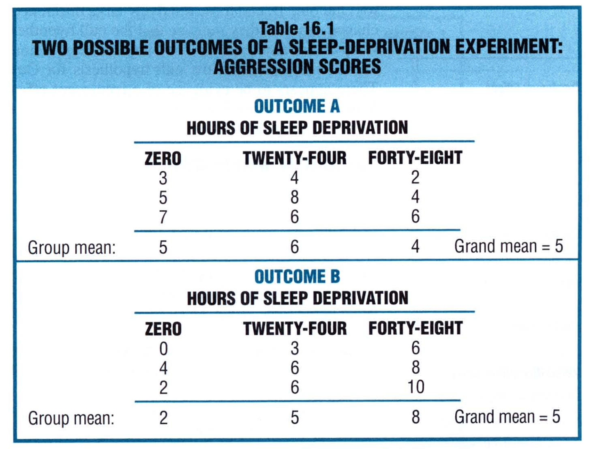
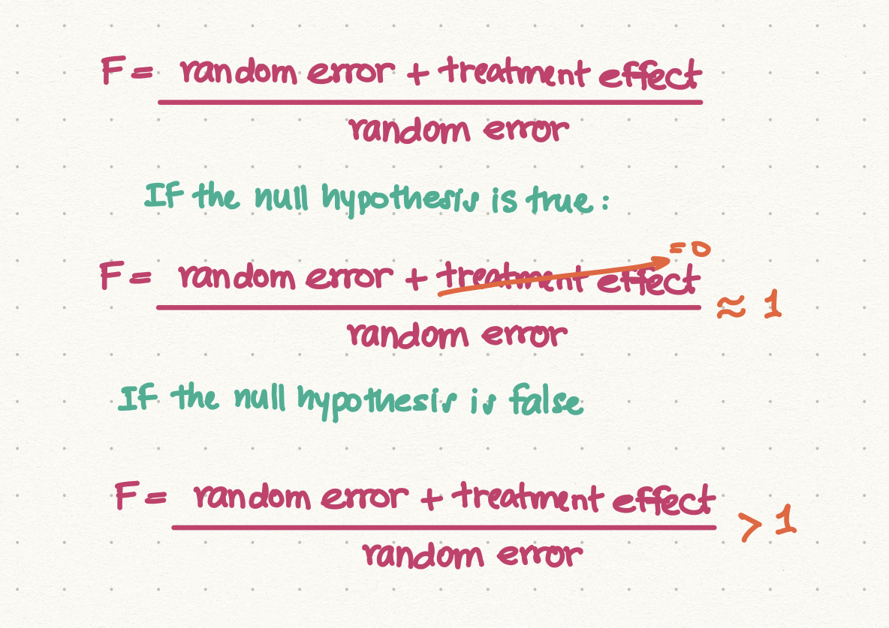
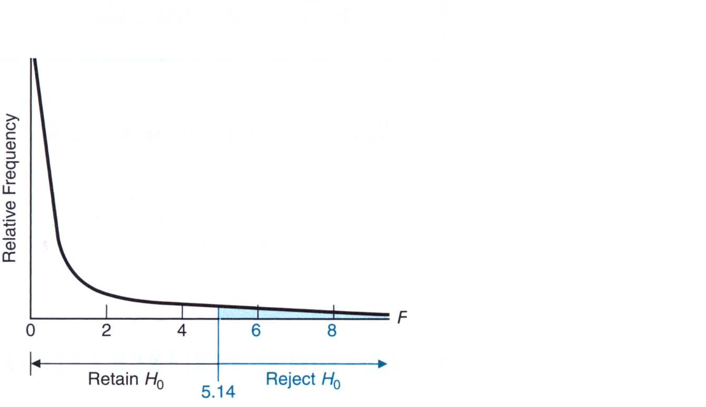

# Chapter 16: Analysis of Variance (One Factor)

In the next three chapters we describe a type of statistical analysis known as *analysis of variance*. The aim of the analysis is to detect differences between two or more groups defined for an independent variable (one factor) with measures on different subjects (Chapter 16); for an independent variable with repeated measures on the same subjects (Chapter 17); and two independent variables (Chapter 18). The analysis aims to test whether the differences between group means are real or due to chance. 

We will consider an example of sleep deprivation and aggression. The question we ask is, does sleep deprivation cause us to be either more or less aggressive? To test we look at subjects that have been deprived of sleep for 0, 24, and 48 hours. This is our independent variable. Subjects are tested for aggressive behavior in a control social environment. 

The null hypothesis, $H_0$, states that there is no difference in the means of the three populations while the alternative hypothesis states that there is a difference, 
$$
H_0 : \mu_0 = \mu_{24} = \mu_{48} \\[20pt]

H_1: H_0 \text{ is false}
$$
We could use the $t$-test for this example, but the $t$-test is generally used for two populations. We cannot use it for three or more populations. 

> $t$-test is used for two populations. When it comes to more than two populations, we need to rely on a new statistical procedure known as **analysis of variance** of ANOVA

## One-Factor ANOVA

The one factor ANOVA tests whether differences exist amont population means categorized by only one factor or independent variable with measures on different subjects. 

One-Factor ANOVA assumes that all scores are independent. In other words, each subject contributes to just one score to the overall analysis. 

### Two Possible Outcomes

The table below shows the two outcomes from our experiment. Let’s assume that only three subjects are assigned for each of the three levels. The scores for three levels are shown below for the two outcomes. 

> In practice, samples that are either unduly small or excessively large should be avoided

## Two Sources of Variability

There are two sources of variability in the data: 

1. **Variability between Group Means:** We see that the variability between group means for Outcome A suggesting that the null hypothesis is correct and should not be rejected. However, for outcome B, the relatively large difference between means suggest that the null hypothesis is probably false. There appears to be evidence of a **treatment effect**, that is, the existance of at least one difference between the population means defined by the independent variable. 
2. **Variability within Groups:** We see that there is more variability within groups for Outcome B than A. In most cases, the scores are symmetric within each group for each Outcome A or B but for B the 24 hours has much larger variability than other groups. 

> In general, the more than variability between groups exceeds the variability within groups, the more suspect will be the null hypothesis

A key point is that the variability withine ach group depends entirely on the scores of subjects treated similarly (exposed to the same sleep deprivation period) and it never involves the scores of subjects treated differently (exposed to different sleep deprivation periods). Therefore, the variability within groups reflects only **random error**. In ANOVA, the within group variance is often referred to as the **error term**, and it is analogous to the pooled variance estimate $(s^2_p)$ in the $t$ test for two independent samples. 

## The F Test

Previously we saw that the null hypothesis was tested with a $t$ ratio. In the two-sample case, the $t$ reflects the ratio between the observed difference between the two sample means in the numerator and the estimated standard error in the denominator. For three or more samples, the null hypothesis is tested with the **F ratio**, 
$$
F = \frac{\text{Variability between Groups}}{\text{Variability within Groups}}
$$
Which we can write it as, 
$$
F = \frac{\text{Random Effect + Treatment Effect}}{\text{Random Effect}}
$$
Like $t$, the F ratio has its own family of sampling distributions that can be consulted using a table to test the null hypothesis. The resulting test is known as an F test

> An F test of the null hypothesis is based on the notion that if the null hypothesis is true, both the numerator and the denominator of the F ratio would tend to be about the same, but if the null hypothesis is false, the numerator would tend to be larger than the denomiator. 

In other words, we would have: 

Just like in Z-statistic or T-statistic, we either fail to reject or reject the null hypothesis by comparing the statistic with the critical score. We do exactly the same in the F test. For example, for a hypothesized sampling distribution of F with 2 and 6 degrees of freedom, the critical F value woul dbe 5.14. We would then have the retain and reject regions for the null hypothesis, 

Let’s work out the example we started with using our hypothesis testing guidelines: 

1. Define the research problem: On average, are subjects’ aggression scores in the control social situation affected by sleep deprived period of 0, 24, or 48 hours? 

2. The statistical hypotheses are: 
   $$
   H_0 : \mu_0 = \mu_{24} = \mu_{48} \\[20pt]
   
   H_1: H_0 \text{ is false}
   $$

3. Decision Rule: We reject the null hypothesis at $\alpha = 0.05$ with $F \geq 5.14$ 

4. Calculations: We find F = 7.36

5. Decision: We reject the null hypothesis at 0.05 level of significance because F = 7.36 exceeds 5.14. 

6. Interpretation: Hours of sleep deprivation affect the subjects’ mean aggression scores in a controlled social situation

## Details: Variance Estimates

In general, the sample variance is defined as, 
$$
s^2 = \frac{\sum(X - \bar{X})^2}{n - 1} = \frac{SS}{df}
$$
where $SS$ is known as the **sum of squares** and $df$ are the degrees of freedom. Note that any sum of squares always equals the sum of squared deviations of some set of scores about their mean. 

In the case of ANOVA, there are two variances: between group variance and within group variance. 

> A variance estimate in ANOVA, referred to as a **mean square**, consists of some sum of squares divided by its degrees of freedom and is given by, 
> $$
> MS = \frac{SS}{df}
> $$

The sum of squares is important in ANOVA to the extent that there are three that we use: 

* **The Sum of Squares (Total):** This is the sum of squared deviations of all scores about the grand mean, where the **grand mean** represents the one overall mean for all scores. This is given by, 
  $$
  SS_{total} = \sum(X - \bar{X}_{grand})^2
  $$
  We can 

  This total sum of squares is not involved in the direct calculations of F ratio, but severs as a valuable computational check. 

* **The Sum of Squares (Between):** This is the sum of squared deviations of group means about the grand mean, where the grand mean represents the overall mean based on all groups. This is given by, 
  $$
  SS_{between} = n\sum(\bar{X}_{group} - \bar{X}_{grand})^2
  $$
  where $n$ represents the number of scores in each group. 

* **The Sum of Squares (Within):** This is the sum of squared deviations of all scores about their respective group means. This is given by, 
  $$
  SS_{between} = \sum(X - \bar{X}_{group})^2
  $$
  where $X$ represents each score and $\bar{X}_{group}$ is the mean for each group. 